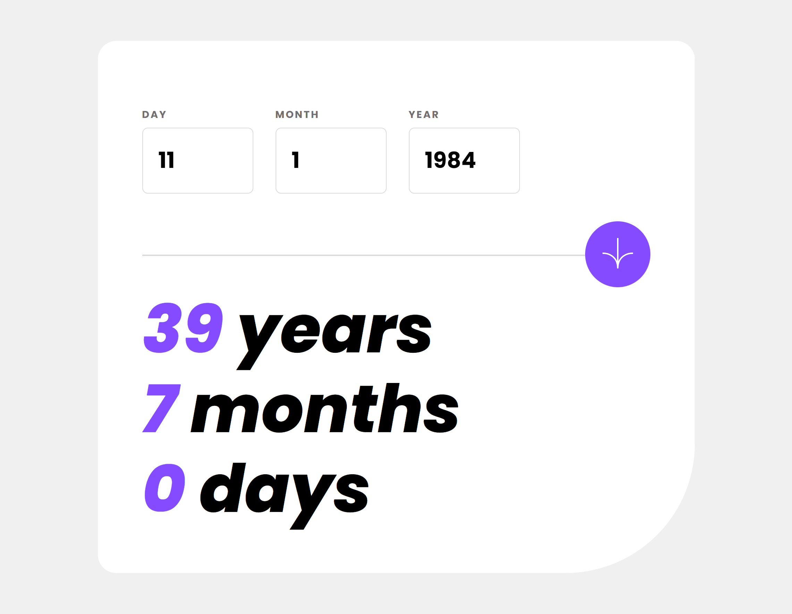
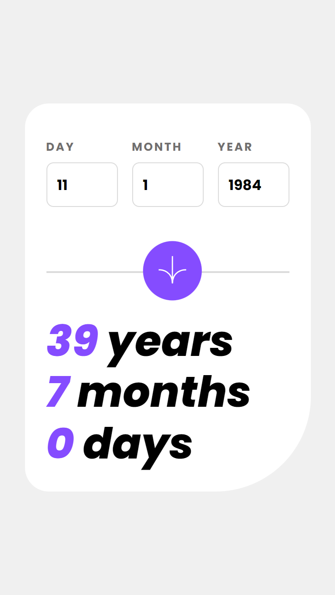

# Frontend Mentor - Age calculator app solution

This is a solution to the [Age calculator app challenge on Frontend Mentor](https://www.frontendmentor.io/challenges/age-calculator-app-dF9DFFpj-Q). Frontend Mentor challenges help you improve your coding skills by building realistic projects.

## Table of contents

- [Overview](#overview)
  - [The challenge](#the-challenge)
  - [Screenshot](#screenshot)
  - [Links](#links)
- [My process](#my-process)
  - [Built with](#built-with)
  - [What I learned](#what-i-learned)
  - [Code highlights](#code-highlights)
  - [Continued development](#continued-development)
- [Author](#author)

## Overview

### The challenge

Users should be able to:

- ✅ View an age in years, months, and days after submitting a valid date through the form
- ✅ Receive validation errors if:
  - Any field is empty when the form is submitted
  - The day number is not between 1-31
  - The month number is not between 1-12
  - The year is in the future
  - The date is invalid e.g. 31/04/1991 (there are 30 days in April)
- ✅ View the optimal layout for the interface depending on their device's screen size
- ✅ See hover and focus states for all interactive elements on the page
- ✅ **Bonus**: See the age numbers animate to their final number when the form is submitted

### Screenshots




### Links

- Solution URL: [Git Repo](https://github.com/mmxcrono/age-calculator-app)
- Live Site URL: [Live](https://mmxcrono.github.io/age-calculator-app)

## My process

I decided to use Vue for this project to show working knowledge and my coding style.
I also wanted to improve my starting point with this stack and examine my own habits.

My steps

1. Identify wrappers needed (flex containers)
2. Identify columns and rows needed
3. Identify possible reusable components
4. Add in styles to get rough look in place
5. Work on components and events emitted
6. Work on logic and unit tests needed
7. Polish styles and add finishing touches to match design

### Built with

- [Vue](https://vuejs.org/)
- [Vue Test Utils](https://test-utils.vuejs.org/)
- [Vite](https://vitejs.dev/)
- [Vitest](https://vitest.dev/)
- [Test Coverage](https://vitest.dev/guide/coverage.html)
- [Prettier](https://prettier.io/)
- [ESLint](https://eslint.org/)
- [Flexbox](https://css-tricks.com/snippets/css/a-guide-to-flexbox/)

### What I learned

I find myself adding tests as I go, but what I would do next time is do [Test-Driven Development](https://staragile.com/blog/test-driven-development#:~:text=TDD%20in%20agile%20is%20a,coding%20phases%20of%20software%20development.)
Creating tests after creating the logic catches things later rather than early on.

Trying to change font by updating variables does not work

```scss
element {
  --fs: var(--fs-700);

  font-size: var(--fs);

  @include response-to(large) {
    --fs: var(--fs-800);
  }
}
```

### Code highlights

Use css variables and formatting to easily identify dynamic and referenced properties vs fixed properties.

```scss
.ago-value {
  --color: var(--clr-primary);
  --transform: unset;
  --transition: color linear 0.5s;

  color: var(--color);
  transition: var(--transition);
  transform: var(--transform);

  display: inline-block;

  &--animate {
    --color: var(--clr-warn);
    --transition: all linear 0.5s;
    --transform: rotate(360deg);
  }
}
```

### Continued development

- Improve tests and reusable components.
- Add dark and light themes

## Author

- Website - [Hoang Nguyen](https://mmxcrono.github.io)
- Frontend Mentor - [@mmxcrono](https://www.frontendmentor.io/profile/mmxcrono)
